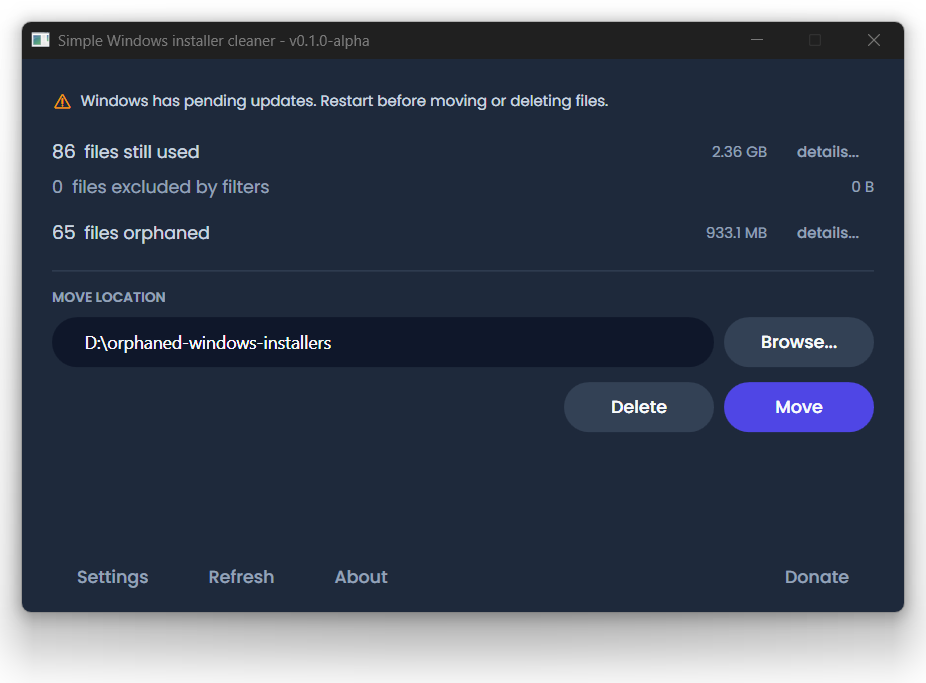

# Simple Windows installer cleaner

A free, open source tool that reclaims disk space by finding orphaned files in `C:\Windows\Installer`.

Windows keeps every MSI installer and MSP patch it has ever used. Over time, many of these become orphaned — the software they belong to has been uninstalled, but the files remain. On a typical machine this wastes anywhere from a few hundred megabytes to 30+ GB.

Simple Windows installer cleaner scans your Installer folder, cross-references every file against the Windows Installer API, and shows you exactly which files are still needed and which are safe to remove.



## How it works

1. Scans `C:\Windows\Installer` for `.msi` and `.msp` files
2. Queries the Windows Installer API to find every file that is still registered to an installed product or patch
3. Cross-references — anything not registered is orphaned
4. Shows a clear summary: files still used, files orphaned and their total size
5. You choose: **move** orphaned files to a safe location, or delete them

Moving is the recommended option. If anything breaks, you can copy the files back.

## Why this exists

[PatchCleaner](https://www.homedev.com.au/free/patchcleaner) did this job well for years, but its last release was **3 March 2016** — a decade ago. It relied on VBScript and WMI, was closed source and occasionally flagged by antivirus software because it lacked a code signing certificate.

This project is a modern replacement:

- **Open source** — read every line of code yourself ([MIT licence](LICENSE))
- **Direct MSI API** — queries the Windows Installer COM interface directly, not WMI
- **.NET 8 / WPF** — no VBScript, no legacy dependencies
- **No installer needed** — download and run
- **No data collection** — doesn't phone home, collect data or require an account

## Getting started

1. Download the latest release from the [releases page](https://github.com/no-faff/windows-installer-cleaner/releases)
2. Right-click the exe and choose **Run as administrator** (required to read the Installer folder)
3. The app scans automatically on startup
4. Choose a move destination and click **Move**, or click **Delete** if you prefer

> **Tip:** If Windows has pending updates, the app will warn you. Restart and install updates before moving or deleting files — a pending update might reference files that appear orphaned but aren't yet registered.

## Features

- **Move or delete** — move is the safe default; delete is available with a confirmation prompt
- **Exclusion filters** — exclude files by name pattern (useful for Adobe products that can appear orphaned when they aren't)
- **Detail views** — inspect individual orphaned and registered files, including product name, file size and digital signature
- **Pending reboot detection** — warns if Windows has pending updates that could affect scan accuracy
- **Settings** — persistent move destination, configurable exclusion filters and reboot check

## Requirements

- Windows 10 or 11
- Administrator privileges (to access `C:\Windows\Installer`)
- .NET 8 runtime (or use the self-contained release which bundles it)

## Building from source

```
git clone https://github.com/no-faff/windows-installer-cleaner.git
cd windows-installer-cleaner
dotnet build src/SimpleWindowsInstallerCleaner/SimpleWindowsInstallerCleaner.csproj
```

Run the tests:

```
dotnet test src/SimpleWindowsInstallerCleaner.Tests/SimpleWindowsInstallerCleaner.Tests.csproj
```

## Is it safe?

- The app only reads from `C:\Windows\Installer` during the scan — it never modifies files until you explicitly click Move or Delete
- Move is always available and always recommended. Moved files can be copied back if needed
- The source code is public and the licence is MIT. You can audit everything

## Part of the No Faff suite

Simple Windows installer cleaner is part of [No Faff](https://github.com/no-faff) — a collection of small, useful Windows utilities. No fuss, no bloat, no accounts.

## Licence

[MIT](LICENSE)
